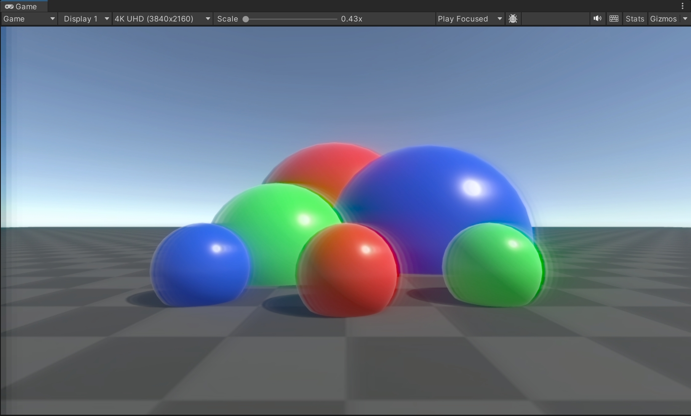
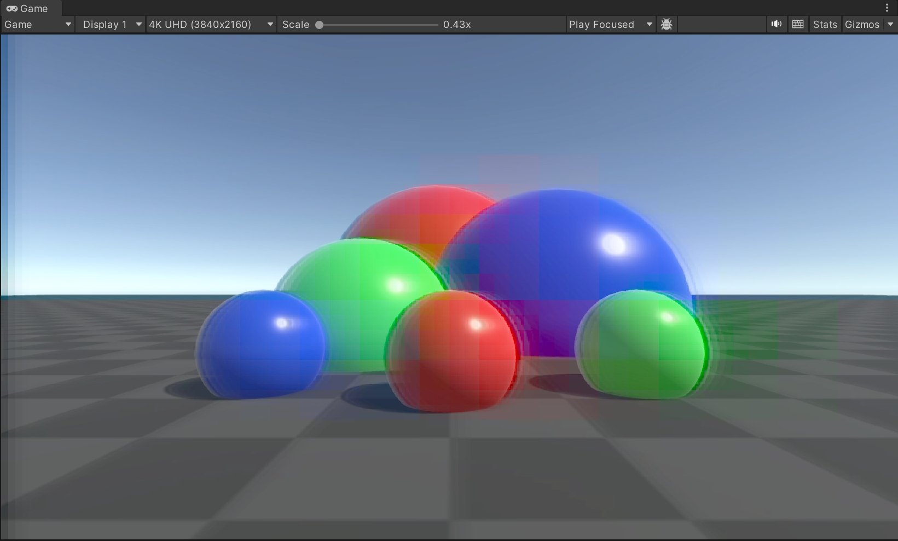

# URP-VHS-Retro-Effects

> Based On Unity 2022.3

https://github.com/user-attachments/assets/7afb5086-af10-41d7-864c-54493b82d02b

## Features

- Color Bleed
- Smear
- Edge Sharpening
- Tape Noises
- Interlacing
- Scanlines
- Film Grain

Please visit [URP中实现 VHS Retro Effect | My Blogs](https://loveforyou.tech/posts/urp-retro-effect/) to get more details

实现的过程中遇到了一些坑

- 使用到了dual blur，用int数组，也就是`RenderTextureIdentifier`的形式来保存dual blur中的多个临时纹理。如果使用`Blitter.BlitterTexture`将`cameraColor`拷贝到第一个`RenderTextureIdentifier`，源纹理出现了货不对版的情况，在FrameDebugg中查看，源纹理变成了深度纹理，或SSAO中的纹理，很奇怪。使用`cmd.Blit`就没有问题

- dual blur过程中所使用的临时纹理，貌似需要使用`R8G8B8A8_SRGB`的格式

  - 分配临时纹理，如果使用的是`cmd.GetTemporaryRT(_XXTexture, width, height, 0, FilterMode.Bilinear);`，会得到`R8G8B8A8_SRGB`格式的纹理，并且blur效果正确

    

  - 而如果使用`cmd.GetTemporayRT(_XXTexture, descriptor)`，虽然可以指定descriptor的`graphcisFormat`为`R8G8B8A8_SRGB`，但最终得到的blur效果会呈现一些网格状：

    

- RGB与YCbCr的正确的相互转换建立在RGB位于Gamma空间的前提下
